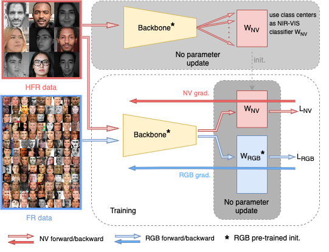

# Rethinking the Domain Gap in Near-infrared Face Recognition, CVPRW 2024
This repository contains the official implementation of the paper [Rethinking the Domain Gap in Near-infrared Face Recognition](https://arxiv.org/abs/2312.00627) accepted in CVPRW 2024. This work explores regularized finetuning methodologies for making the most out of large scale RGB pretraining and improving NIR-VIS face recognition. 




### Abstract
Heterogeneous face recognition (HFR) involves the intricate task of matching face images across the visual domains of visible (VIS) and near-infrared (NIR). While much of the existing literature on HFR identifies the domain gap as a primary challenge and directs efforts towards bridging it at either the input or feature level, our work deviates from this trend. We observe that large neural networks, unlike their smaller counterparts, when pre-trained on large scale homogeneous VIS data, demonstrate exceptional zero-shot performance in HFR, suggesting that the domain gap might be less pronounced than previously believed. By approaching the HFR problem as one of low-data fine-tuning, we introduce a straightforward framework: comprehensive pre-training, succeeded by a regularized fine-tuning strategy, that matches or surpasses the current state-of-the-art on four publicly available benchmarks. Given its simplicity and demonstrably strong performance, our method could be used as a practical solution for adjusting face recognition models to HFR as well as a new baseline for future HFR research.


## Environment Setup
Set up a conda environment to run the model using the following commands:
```bash
conda create -n rethink_nirvis python=3.9

conda activate rethink_nirvis

## Install requirements
pip install -r requirements.txt
```

## Datasets

Dataset preparation scripts for the four datasets used in the paper ([Lamp-HQ](https://link.springer.com/article/10.1007/s11263-021-01432-4), [VASIA-NIRVIS](https://pythonhosted.org/bob.db.cbsr_nir_vis_2/), [Oulu-CASIA](https://www.v7labs.com/open-datasets/oulu-casia), [BUUA-NIRVIS](https://paperswithcode.com/sota/face-verification-on-buaa-visnir?p=wasserstein-cnn-learning-invariant-features)) can be found in `data/crop_and_align.py`. 


## Training

Note: You will need to modify config files in `train/configs` accordingly to train with own data. 

### Pretraining 
We pretrain our models on the [MS1MV3 dataset](https://openaccess.thecvf.com/content_ICCVW_2019/papers/LSR/Deng_Lightweight_Face_Recognition_Challenge_ICCVW_2019_paper.pdf) 
on an 8 GPU server using the following command:

```bash
python3 -m torch.distributed.launch --nproc_per_node=8 --nnodes=1 --node_rank=0 --master_addr="127.0.0.0" --master_port=1234  pretrain.py --config config_pretrain | tee hist.log
```

where `config_pretrain` points to a config file, here `train/configs/pretrain/config_pretrain.py`.

### Finetuning on NIR-VIS datasets
We finetune on a NIR-VIS dataset, on a single GPU setup using the following command:

```bash
python3 -m torch.distributed.launch --nproc_per_node=1 --nnodes=1 --node_rank=0 --master_addr="127.0.0.0" --master_port=1234 finetune_method.py --config <path to config file >  | tee hist.log
```

where `<path to config file .py>` points to a config file as found in `train/configs/finetune` and `finetune_method.py`
points to a finetuning method as discussed in the paper. There are four options to choose from:

- `finetune_MEC.py` uses the Mean Embedding Classifier method.
- `finetune_SSC.py` uses the Sub-Space Classifier method.
- `finetune_MEC.py` uses the Mean Embedding Classifier method with joint pretrain data training.
- `finetune_MEC.py` uses the Sub-Space Classifier method with joint pretrain data training.

## Evaluation
Evaluating a pretrained model on one of the four datasets is performed by running:

```bash
python eval_script.py --checkpoint <path to specific checkpoint or directory> --architecture <architecture> --gpu_ids <gpu ids>
```

where `<path to specific checkpoint or directory>` points to a specific checkpoint or a directory of saved checkpoints. In the latter case all checkpoints in the directory will be used for evaluation.
Parameter `<architecture>` defines the backbone architecture employed. There are four option to choose from using this codebase, namely `iresnet18`, `iresnet50`, `iresnet100`, `mobilefacenet`, `lightcnn29v2`.
Finally, `eval_script.py` points to the evaluation script which is specific to the employed dataset:
- `evaluate/eval_lamp_hq.py`
- `evaluate/eval_casia.py`
- `evaluate/eval_oulu_casia.py`
- `evaluate/eval_buua.py`

## Pretrained Checkpoints
Pretrained checkpoints can be downloaded using the following links:

| Architecture  | Module | Pretrain Set | Finetuning Set | Link  |
|---------------|--------|--------------|----------------|-------|
| IR50          | backbone   | MS1M     | -              | [google drive](https://drive.google.com/file/d/13zo7KsIpVupRnPfTnE21T-Qdrz8TI8Uj/view?usp=drive_link) |
| IR50          | classifier | MS1M     | -              | [google drive]() |
| MobileFaceNet | backbone   | MS1M     | -              | [google drive](https://drive.google.com/file/d/1cVNwrAeCGR412ArF5oo1Cq3ZtJZMjaw4/view?usp=drive_link) |
| MobileFaceNet | classifier | MS1M     | -              | [google drive]() |
| MobileFaceNet | backbone   | MS1M     | LampHQ-1of10         | [google drive](https://drive.google.com/file/d/1jF9DOve-K4RVlIJvnmzSZEY_9rqFu62m/view?usp=drive_link) |
| MobileFaceNet | backbone   | MS1M     | CASIA-1of10          | [google drive](https://drive.google.com/file/d/1N6l06_aWl-MlukLtrzqx8Dh3cgugqICp/view?usp=drive_link) |
| MobileFaceNet | backbone   | MS1M     | Oulu-CASIA     | [google drive](https://drive.google.com/file/d/1aEFKBfxa0i4ABxyECaPUJaTgM1s9Xftg/view?usp=drive_link) |
| MobileFaceNet | backbone   | MS1M     | BUUA           | [google drive](https://drive.google.com/file/d/1P_Myh0LAn-y5D_4oePjx0NB61ySWmrTX/view?usp=drive_link) |
